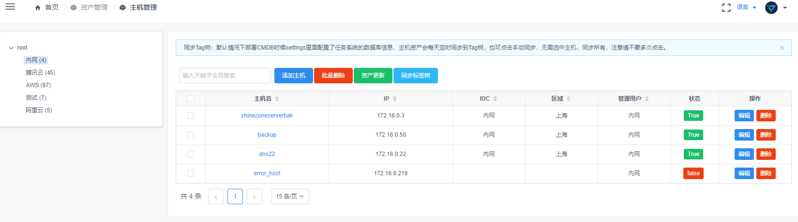
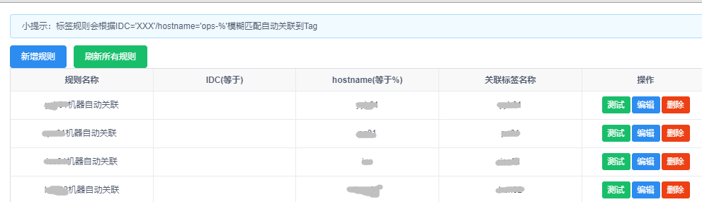
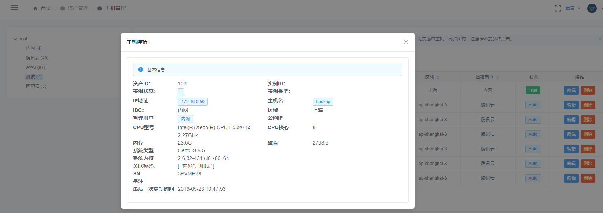
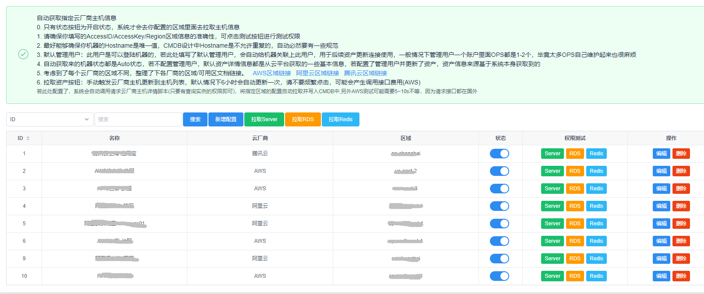

### 资产管理

> 基于Python Tornado实现的一套CMDB资产管理系统，前端使用Vue+Iview-admin


**目前功能**  

- 支持主机记录
- 支持数据库记录
- 支持自定义IDC机房
- 支持Server/DB批量添加、删除
- 支持基于Tag管理实现用户访问资产授权
- 支持AWS/阿里云/腾讯云 AWS/RDS/Cache自动获取
- 支持IDC、Server、DB 操作记录(POST\PUT\DELETE)
- 支持标签管理、标签规则管理、自定义规则自动加入Tag
- 支持主表和详情表分离，可不影响数据的情况下进行扩展
- 支持(自动、手动)发现AWS、阿里云、腾讯云主机、DB、Cache


**功能排期**

- CMDB跳板机功能
- Ucloud 云服务器支持


#### 截图

- 放一些简单示例图片，详细的使用可参考[部署文档](http://docs.opendevops.cn/zh/latest/codo-cmdb.html)、[Demo体验](https://demo.opendevops.cn/login)、[视频示例](https://www.bilibili.com/video/av53408299/) 

  



  



#### 部署文档

> Docker部署方式

**创建数据库**

```
create database `codo_cmdb` default character set utf8mb4 collate utf8mb4_unicode_ci;
```
**修改配置**

- 修改`settings.py`配置信息
  - 注意：需要修改的信息在`settings.py`里面已经标注
  - 请确保你`settings`信息里面`mysql redis`等配置信息的准确性
- `docs/nginx_ops.conf`文件
   - 建议保持默认，毕竟都是内部通信，用什么域名都无所谓，到时候只修改前端访问的域名即可
   - 若你这里修改了，后面DNS、网关都要记得跟着修改为这个域名


**打包镜像**

```
docker build . -t codo_cmdb
```

**启动Docker**

```
docker-compose up -d
```

**初始化表结构**

```
#若是在本地执行需要安装很多SDK包的依赖，建议进入容器执行
#cmdb_codo_cmdb_1:是你的容器名称
docker exec -ti cmdb_codo_cmdb_1 /usr/local/bin/python3 /var/www/codo-cmdb/db_sync.py
```

**日志文件**
- 服务日志：`/var/log/supervisor/cmdb.log`  #主程序日志
- 定时日志：`/var/log/supervisor/cmdb_cron.log` #一些后端守护自动运行的日志

**接口测试**

- 可查看日志看是否有报错
- 默认端口：8050，可直接测试Are you ok?
```
#返回200
 curl -I -X GET -m 10 -o /dev/null -s -w %{http_code} http://${cmdb_domain}:8050/are_you_ok/
```


### 服务注册

>  由于我们每个模板都是单独部署的，微服务需要在API网关进行注册

**示例**

```
rewrite_conf = {
    [gw_domain_name] = {
        rewrite_urls = {
            {
                uri = "/cmdb2",
                rewrite_upstream = "cmdb2.opendevops.cn:8050"  #nginx配置的域名
            },
            {
                uri = "/mg",
                rewrite_upstream = "mg.opendevops.cn:8010"
            },
            {
                uri = "/accounts",
                rewrite_upstream = "mg.opendevops.cn:8010"
            },
        }
    }
}
```
